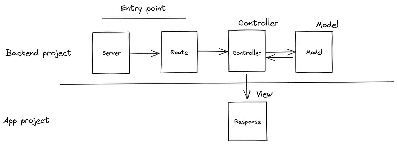

# 📚 API Livraria com Express.js — Parte 3

## Implementação com JSON + MVC

<ul class="small bottom">
    <li>👨‍🏫 <b>Professor:</b> Fabricio Bizotto</li>
    <li>📘 <b>Disciplina:</b> Desenvolvimento Web I</li>
    <li>🎓 <b>Curso:</b> Ciência da Computação</li>
    <li>📅 <b>Fase:</b> 4ª fase</li>
</ul>

---

# Roteiro

- Implementar a API RESTful com Express.js
- Criar um arquivo `livros.json` para armazenar os dados
- Consolidar a lógica de acesso a dados diretamente no `Controller`
- Instruir sobre como rodar, testar e evoluir o projeto

---

# Estrutura do projeto (simplificada)

```
livraria_node_http/
├─ server.js
├─ .env
├─ package.json
└─ src/
   ├─ app.js
   ├─ config/express.js
   ├─ middlewares/errorHandler.js
   ├─ routes/
   │  ├─ index.js
   │  └─ livros.routes.js
   └─ controllers/
      └─ livros.controller.js  <-- contém lógica de acesso a JSON
   └─ data/
      └─ livros.json
```

---

# Requisitos (instalação)

```bash
npm init -y
npm install express dotenv morgan
npm install --save-dev nodemon
```

Atualize `package.json` com scripts:

```json
"scripts": {
  "start": "node server.js",
  "dev": "nodemon server.js"
}
```

> Essa etapa já foi feita na parte anterior, mas é bom relembrar.

---

# Arquivo `.env` recomendado

```env
NODE_ENV=development
PORT=3000
```

> Essa etapa já foi feita na parte anterior, mas é bom relembrar.

---

# `server.js` (ponto de entrada)

```js
require('dotenv').config();
const app = require('./src/app');
const PORT = process.env.PORT || 3000;
const NODE_ENV = process.env.NODE_ENV || 'development';

app.listen(PORT, () => {
  console.log(`Servidor iniciado na porta ${PORT} (${NODE_ENV})`);
});
```

> Essa etapa já foi feita na parte anterior, mas é bom relembrar.

---

# `src/config/express.js` (config básica)

```js
const express = require('express');
const morgan = require('morgan');
const app = express();

app.use(express.json());
app.use(express.urlencoded({ extended: true }));
app.use(morgan('common'));

module.exports = app;
```

> Essa etapa já foi feita na parte anterior, mas é bom relembrar.

---

# `src/app.js` (orquestração)

```js
const app = require("./config/express");
// Todas as rotas da aplicação
const routes = require("./routes");
// Configura o middleware de tratamento de erros
const errorHandler = require("./middlewares/errorHandler");

// Configura as rotas
app.use("/api", routes);

app.use(errorHandler);

// Handler para rotas não encontradas (404)
app.use((req, res) => {
    res.status(404).json({ erro: "Endpoint não encontrado" });
});


module.exports = app;
```

---

<!-- class: title -->

# Base de Dados

## `src/data/livros.json`

---

<!-- class: "" -->

# Base de Dados

Para simular um banco de dados simples, usaremos um arquivo JSON (`src/data/livros.json`) para armazenar os dados dos livros.

```json
[
  {
    "id": 1,
    "titulo": "Clean Code",
    "autor": "Robert C. Martin",
    "categoria": "Programação",
    "ano": 2008
  },
]
```

---

<!-- class: title -->
# Model-View-Controller (MVC)



Modelo-Visão-Controlador (MVC) é um padrão de arquitetura de software que separa a aplicação em três componentes principais: Modelo, Visão e Controlador.

---

<!-- class: "" -->

# `src/controllers/livros.controller.js`

```js
const fs = require("fs");
const path = require("path");

class LivrosController {
    constructor() {
        this.caminhoArquivo = path.join(__dirname, "../data/livros.json");
    }

    // ============= MÉTODOS PRIVADOS DE ACESSO A DADOS =============
    // ... métodos privados para ler/escrever JSON ...

}

```

---

# `src/controllers/livros.controller.js` (continuação)

```js
// ... continuação do código anterior ...
    async _salvarArquivo(data) {
        try {
            fs.writeFileSync(this.caminhoArquivo, JSON.stringify(data, null, 2), 'utf8');
        } catch (error) {
            throw new Error(`Erro ao salvar arquivo de livros: ${error.message}`);
        }
    }

    async _lerArquivo() {
        try {
            return await fs.promises.readFile(this.caminhoArquivo, 'utf8');
        } catch (error) {
            throw new Error(`Erro ao ler arquivo de livros: ${error.message}`);
        }
    }

```

---

# `src/controllers/livros.controller.js` (continuação)

```js
// ... continuação do código anterior ...
    async _findAll() {
        const dados = await this._lerArquivo();
        return JSON.parse(dados);
    }

    async _findById(id) {
        const livros = await this._findAll();
        return livros.find(livro => livro.id === id);
    }

    async _getNextId() {
        const livros = await this._findAll();
        if (livros.length === 0) return 1;
        return Math.max(...livros.map(livro => livro.id)) + 1;
    }
```

---

# `src/controllers/livros.controller.js` (continuação)

```js
// ... continuação do código anterior ...
    async _create(livroData) {
        const livros = await this._findAll();

        // Gera novo ID baseado no maior ID existente
        const novoId = await this._getNextId();
        const novoLivro = { id: novoId, ...livroData };

        livros.push(novoLivro);
        await this._salvarArquivo(livros);

        return novoLivro;
    }
```

---

# `src/controllers/livros.controller.js` (continuação)

```js
// ... continuação do código anterior ...
    async _update(id, dadosAtualizados) {
        const livros = await this._findAll();
        const indice = livros.findIndex(livro => livro.id === id);

        if (indice === -1) {
            const error = new Error("Livro não encontrado");
            error.statusCode = 404;
            throw error;
        }

        livros[indice] = { ...livros[indice], ...dadosAtualizados };
        await this._salvarArquivo(livros);

        return livros[indice];
    }
```

---

# `src/controllers/livros.controller.js` (continuação)

```js
// ... continuação do código anterior ...
    async _delete(id) {
        const livros = await this._findAll();
        const indice = livros.findIndex(livro => livro.id === id);

        if (indice === -1) {
            const error = new Error("Livro não encontrado");
            error.statusCode = 404;
            throw error;
        }

        const livroRemovido = livros[indice];
        livros.splice(indice, 1);
        await this._salvarArquivo(livros);

        return livroRemovido;
    }
```

---

# `src/controllers/livros.controller.js` (continuação)

✔ Agora, os métodos públicos que serão usados nas rotas:

```js
// ... continuação do código anterior ...
    async listarLivros(req, res, next) {
        const livros = await this._findAll();
        res.status(200).json(livros);
    }
    
    async buscarLivroPorId(req, res, next) {
        const id = parseInt(req.params.id);
        const livro = await this._findById(id);
        if (!livro) {
            return res.status(404).json({ erro: "Livro não encontrado" });
        }
        res.status(200).json(livro);
    }
```

---

# `src/controllers/livros.controller.js` (continuação)

```js
// ... continuação do código anterior ...
    async criarLivro(req, res, next) {
        const { titulo, autor, categoria, ano } = req.body;
        const novoLivro = await this._create({
            titulo,
            autor,
            categoria,
            ano: parseInt(ano)
        });
        res.status(201).json({
            mensagem: "Livro criado com sucesso",
            data: novoLivro
        });
    }
```

---

# `src/controllers/livros.controller.js` (continuação)

```js
// ... continuação do código anterior ...
    async atualizarLivro(req, res, next) {
        const id = parseInt(req.params.id);
        const { titulo, autor, categoria, ano } = req.body;
        const livroAtualizado = await this._update(id, {
            titulo,
            autor,
            categoria,
            ano: parseInt(ano)
        });

        res.status(200).json({
            mensagem: "Livro atualizado com sucesso",
            data: livroAtualizado
        });
    }
```

---

# `src/controllers/livros.controller.js` (continuação)

```js
// ... continuação do código anterior ...
    async removerLivro(req, res, next) {
        const id = parseInt(req.params.id);
        const livroRemovido = await this._delete(id);
        res.status(200).json({
            mensagem: "Livro removido com sucesso",
            data: livroRemovido
        });
    }
}

module.exports = LivrosController;
```

---

<!-- class: title -->

# Validações e Middlewares
## `src/middlewares/validar/livros.validar.js`

---

<!-- class: "" -->

# `src/middlewares/validar/livros.validar.js`

```js
const validarLivro = (req, res, next) => {
    const { titulo, autor, categoria, ano } = req.body;
    const erros = [];

    if (!titulo?.trim()) erros.push("Título é obrigatório");
    if (!autor?.trim()) erros.push("Autor é obrigatório");
    if (!categoria?.trim()) erros.push("Categoria é obrigatória");
    if (!ano || isNaN(parseInt(ano))) erros.push("Ano deve ser um número válido");

    if (erros.length > 0) {
        return res.status(400).json({ erro: "Dados inválidos", detalhes: erros });
    }

    next();
}

const validarParamId = (req, res, next) => {
    const id = parseInt(req.params.id);
    if (isNaN(id)) {
        return res.status(400).json({ erro: "ID deve ser um número válido" });
    }
    next();
}

module.exports = { validarLivro, validarParamId };
```

---

<!-- class: title -->

# Rotas de Livros
## `src/routes/livros.routes.js`

---

<!-- class: "" -->

# `src/routes/livros.routes.js` (exemplo)

```js
const express = require("express");
const router = express.Router();

// Controllers
const LivrosController = require("../controllers/livros.controller");
const livrosController = new LivrosController();

// Middlewares
const { validarLivro, validarParamId } = require("../middlewares/validar/livros.validar");

router.get("/", (req, res, next) => livrosController.listarLivros(req, res, next));
router.get("/:id", validarParamId, (req, res, next) => livrosController.buscarLivroPorId(req, res, next));
router.post("/", validarLivro, (req, res, next) => livrosController.criarLivro(req, res, next));
router.put("/:id", validarParamId, validarLivro, (req, res, next) => livrosController.atualizarLivro(req, res, next));
router.delete("/:id", validarParamId, (req, res, next) => livrosController.removerLivro(req, res, next));

module.exports = router;
```

---

# Testes rápidos com curl

```bash
# Listar
curl http://localhost:3000/api/livros

# Buscar por id
curl http://localhost:3000/api/livros/1

# Criar
curl -X POST http://localhost:3000/api/livros -H "Content-Type: application/json" -d '{"titulo":"Novo Livro","autor":"Autor","categoria":"Categ","ano":2025}'

# Atualizar
curl -X PUT http://localhost:3000/api/livros/2 -H "Content-Type: application/json" -d '{"titulo":"Alterado","autor":"Autor","categoria":"Categ","ano":2025}'

# Deletar (id que não existe deve devolver 404)
curl -X DELETE http://localhost:3000/api/livros/2
```

---

# Próximos passos e melhorias

- Mover lógica de persistência para uma camada separada (Repository)
- Substituir JSON por banco de dados relacional (SQLite, MySQL, PostgreSQL)
- Adicionar testes automatizados (Jest + supertest)
- Implementar autenticação e autorização (sessão, JSON Web Token - JWT)

---

# Desafios

- Implementar paginação na listagem de livros (GET /api/livros?page=1&limit=10).